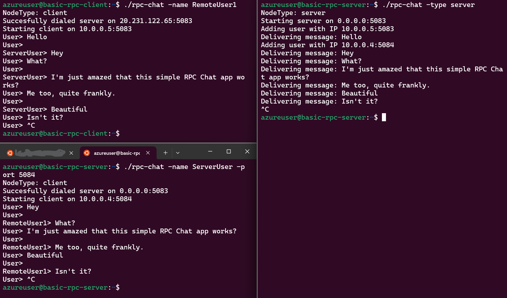

# Multi-Client Chat Application

## Overview
This project is a multi-client chat application that demonstrates the use of Remote Procedure Calls (RPC) in a distributed systems environment. It consists of two main components: a server that handles incoming messages and client applications that send messages to the server.

## Features
- **Multi-Client Support**: Enhanced to allow multiple clients to connect and communicate through the server.
- **RPC Implementation**: Uses RPC for sending and receiving messages between clients and the server.
- **Real-time Messaging**: Clients can send and receive messages in real-time.
- **Scalable Architecture**: Designed to be scalable to accommodate more clients with minimal changes.

## Getting Started

### Prerequisites
- Linux
- Golang

### Running the Application
1. Setup config.json
   ```json
   {
      "serverIP": "<remote-server-ip>:<exposed-port>",
      "clientIP": "<local-public-ip>"
   }
   ```
2. Start the server:
   ```bash
   go run main.go -type server
   ```
3. In a new terminal, start a client:
   ```bash
   go run main.go -name <username> -port <exposed-port>
   ```
4. Repeat step 2 to open multiple clients.

## Example Usage


## Design
### Base
All nodes will essentially be running the same logic but with different paths depending on their role. The basic logic will establish the listening RPC logic. When a node receives a message, it will store the user's IP in order to keep track of all clients participating.

In the current iteration of this repo, the client does not use the stored IPs, but this allows it to be expanded to allow other clients the ability to receive chat-room history through P2P.

### Client
The client nodes will spin off the base by reacting to messages on the handler by showing them to the user. They will also establish a connection to the server node and begin relaying messages from the user.

#### Server
The server node differs from the base by storing messages sent to it from clients, storing the IP and sending the message to all clients in the send list. If a client does not ack the message, it will be removed from the stored list.